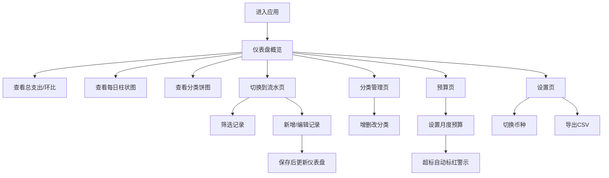

## 1. 产品概述

个人财务管理记账看板应用，帮助用户追踪日常支出、分析消费习惯、设定预算目标。目标用户为需要管理个人/家庭开销的普通用户，核心价值是提供直观的数据可视化和便捷的记账流程。

## 2. 核心功能

### 2.2 功能模块

1. **仪表盘页**：本月总支出展示、环比涨跌、按天柱状图、分类占比饼图
2. **流水页**：交易记录列表、分类/时间筛选、单条编辑、新增记录
3. **分类管理页**：分类增删改、颜色配置、图标配置
4. **预算页**：月度预算上限设置、实时进度、超标标红警示
5. **设置页**：币种切换、CSV数据导出

### 2.3 页面详情

| 页面名称 | 模块名称 | 功能描述 |
|-----------|-------------|---------------------|
| 仪表盘 | 总支出卡片 | 大数字显示本月总支出，环比涨跌百分比箭头指示 |
| 仪表盘 | 每日花销柱状图 | 按天展示当月每天支出金额，悬停显示tooltip |
| 仪表盘 | 分类占比饼图 | 餐饮/交通/购物等分类占比，悬停显示具体金额 |
| 流水 | 记录列表 | 金额、分类、日期、备注，按时间倒序 |
| 流水 | 筛选面板 | 分类多选、日期范围选择 |
| 流水 | 编辑弹窗 | 点击单条记录弹出编辑表单 |
| 分类管理 | 分类卡片列表 | 显示颜色、图标、名称、删除按钮 |
| 分类管理 | 新增/编辑表单 | 名称输入、颜色选择器、图标选择 |
| 预算 | 预算设置 | 输入月度预算上限金额 |
| 预算 | 进度条 | 已用金额/预算金额进度条，超标显示红色 |
| 设置 | 币种选择 | 下拉选择常用货币（CNY/USD/EUR等） |
| 设置 | CSV导出 | 一键导出所有交易记录为CSV文件 |

## 3. 核心流程

用户进入仪表盘查看当月消费概况 → 如需记录新支出，在流水页点击新增 → 填写金额、选择分类、日期和备注 → 保存后仪表盘数据自动更新 → 可在分类管理页维护自定义分类 → 在预算页设置月度上限监控消费 → 在设置页导出数据备份。

## 4. 用户界面设计

### 4.1 设计风格

- **主色调**：深靛蓝 (#6366f1) 作为主色，珊瑚红 (#f43f5e) 警示色，翠绿 (#10b981) 增长色
- **深色主题**：背景采用深灰 (#0f172a) → (#1e293b) 渐变，卡片使用 (#1e293b) 背景
- **卡片风格**：圆角 16px，阴影采用多层半透明黑色叠加营造深度
- **字体**：数字使用 JetBrains Mono 等宽字体，正文使用现代无衬线字体
- **图标风格**：Lucide 线性图标，与分类颜色统一

### 4.2 页面设计概览

| 页面名称 | 模块名称 | UI 元素 |
|-----------|-------------|-------------|
| 仪表盘 | 顶部总支出卡片 | 超大数字（48px等宽字体）、环比箭头（绿色↑/红色↓）、渐变背景 |
| 仪表盘 | 柱状图区域 | 卡片容器、X轴日期、Y轴金额、柱子悬停高亮+tooltip |
| 仪表盘 | 饼图区域 | 卡片容器、图例带颜色圆点、扇区悬停高亮+tooltip |
| 流水 | 筛选栏 | 分类标签多选、日期选择器、重置按钮 |
| 流水 | 列表项 | 分类颜色圆点、分类名称、备注小字、右侧金额+日期、悬停阴影 |
| 流水 | 编辑弹窗 | 半透明遮罩、居中白色卡片、表单输入、保存/取消按钮 |
| 分类管理 | 分类卡片 | 彩色图标方块、名称、编辑/删除操作按钮 |
| 预算 | 进度条 | 渐变色进度条、中间显示百分比、超标整段变红并闪烁 |
| 设置 | 设置卡片 | 分组标题、下拉选择器、主色调按钮 |

### 4.3 响应式

桌面端优先设计（最小宽度 1280px），左侧固定导航栏（240px），右侧内容区自适应。在 < 1024px 宽度时导航折叠为抽屉式菜单。

