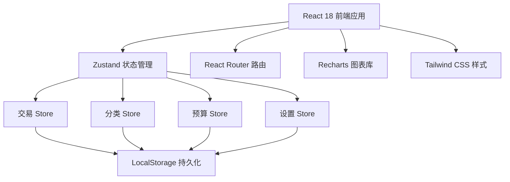
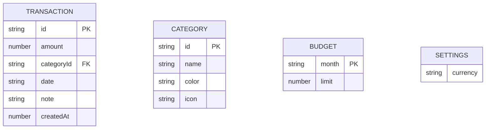

## 1. 架构设计



## 2. 技术描述

- **前端框架**：React@18 + TypeScript + Vite
- **初始化工具**：vite-init (react-ts 模板)
- **后端**：无后端，纯前端 LocalStorage 持久化
- **状态管理**：Zustand
- **路由**：React Router DOM
- **图表库**：Recharts（柱状图、饼图，自带 tooltip）
- **样式**：Tailwind CSS 3.x + 自定义深色主题
- **图标**：Lucide React

## 3. 路由定义

| 路由 | 页面组件 | 功能说明 |
|-------|---------|----------|
| / | Dashboard | 仪表盘首页，默认重定向 |
| /dashboard | Dashboard | 总支出、环比、柱状图、饼图 |
| /transactions | Transactions | 交易流水列表、筛选、编辑 |
| /categories | Categories | 分类增删改管理 |
| /budget | Budget | 月度预算设置与进度 |
| /settings | Settings | 币种设置、CSV导出 |

## 4. 数据模型

### 4.1 数据模型定义



### 4.2 TypeScript 类型定义

```typescript
interface Transaction {
  id: string;
  amount: number;
  categoryId: string;
  date: string;        // YYYY-MM-DD
  note: string;
  createdAt: number;
}

interface Category {
  id: string;
  name: string;
  color: string;       // HEX color
  icon: string;        // Lucide icon name
}

interface Budget {
  [month: string]: number;  // key: YYYY-MM, value: limit amount
}

interface Settings {
  currency: 'CNY' | 'USD' | 'EUR' | 'JPY' | 'GBP';
}
```

### 4.3 初始数据（Mock）

**默认分类**：
- 餐饮 (🍜 / #f97316)
- 交通 (🚗 / #3b82f6)
- 购物 (🛍️ / #ec4899)
- 娱乐 (🎮 / #a855f7)
- 居住 (🏠 / #14b8a6)
- 医疗 (💊 / #ef4444)
- 教育 (📚 / #22c55e)
- 其他 (📦 / #6b7280)

**示例交易记录**：生成近30天的随机交易数据用于演示。

## 5. 项目目录结构

```
src/
├── components/
│   ├── Layout.tsx            # 左侧导航 + 右侧内容布局
│   ├── Sidebar.tsx           # 导航菜单组件
│   ├── StatCard.tsx          # 统计卡片组件
│   ├── Modal.tsx             # 通用弹窗组件
│   ├── CategoryBadge.tsx     # 分类标签组件
│   └── EmptyState.tsx        # 空状态组件
├── pages/
│   ├── Dashboard.tsx         # 仪表盘页
│   ├── Transactions.tsx      # 流水页
│   ├── Categories.tsx        # 分类管理页
│   ├── Budget.tsx            # 预算页
│   └── Settings.tsx          # 设置页
├── store/
│   ├── useTransactionStore.ts   # 交易状态管理
│   ├── useCategoryStore.ts      # 分类状态管理
│   ├── useBudgetStore.ts        # 预算状态管理
│   └── useSettingsStore.ts      # 设置状态管理
├── utils/
│   ├── format.ts             # 金额/日期格式化工具
│   ├── csv.ts                # CSV导出工具
│   └── seed.ts               # 初始化mock数据
├── types/
│   └── index.ts              # 全局类型定义
├── App.tsx                   # 路由入口
├── main.tsx                  # 应用入口
└── index.css                 # Tailwind 入口 + 全局样式
```

